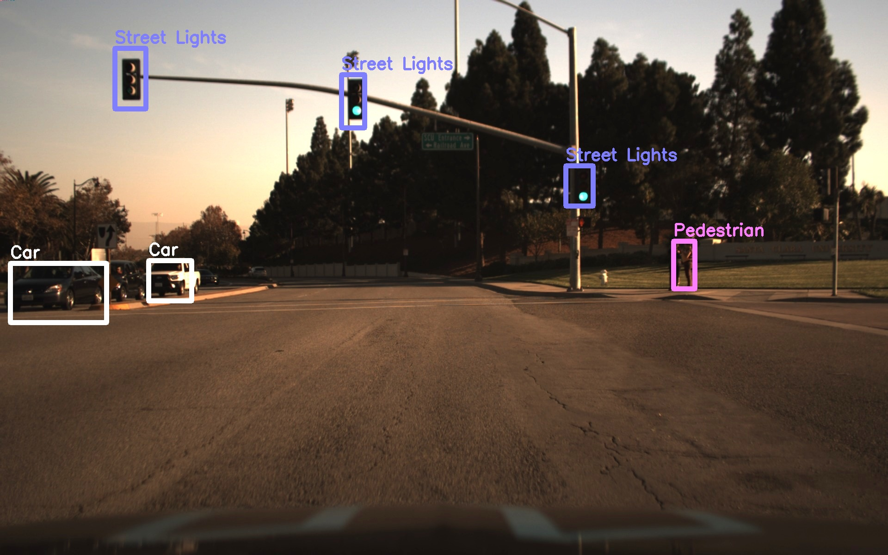
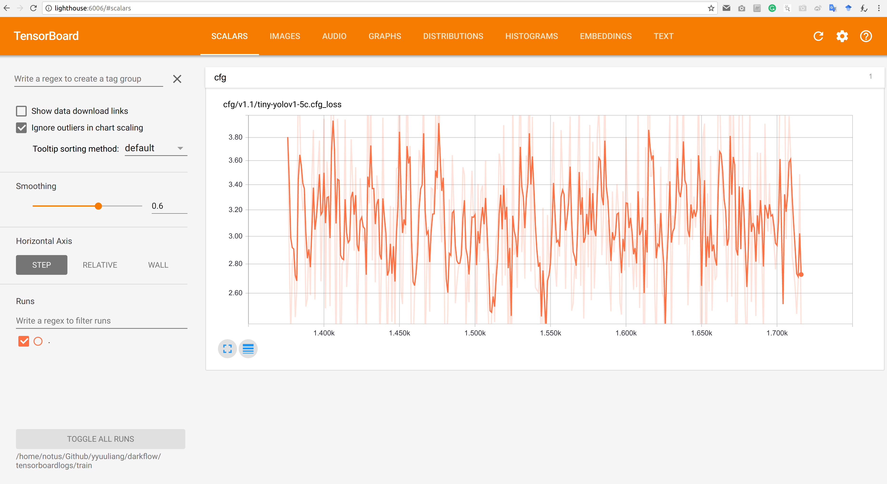
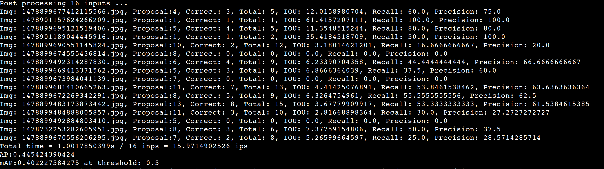
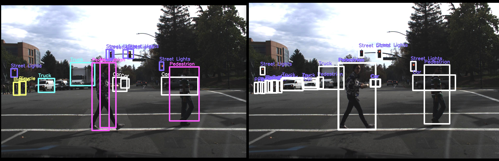
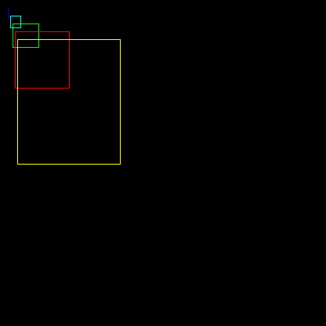
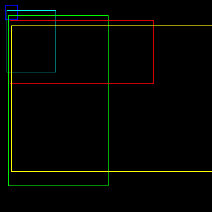

## Acknowledgment
The work is originally done by [@y22ma](https://github.com/y22ma/darkflow).    

## Development Environment

- Tensorflow 1.14
- Python 3.5

## Quick guide for training(YOLO v2)
- Download Udacity dataset and csv [here](https://github.com/udacity/self-driving-car/tree/master/annotations). Put both in udacity folder.
- Download tiny-yolo-voc.weights file [here](https://github.com/leetenki/YOLOtiny_v2_chainer/blob/master/tiny-yolo-voc.weights). Put it in bin folder.
- Change the csv file's location to your own in the following file: 
```bash
# utils/udacity_voc_csv.py: line 29
csv_fname = os.path.join('/home/notus/Github/yyuuliang/darkflow/udacity/udacity-t.csv')
```
- Change the TensorBoard log dir
```bash
# net/build.py: line 99
sumpath = '/home/notus/Github/yyuuliang/darkflow/tensorboardlogs/'
```
- Start the training:
```bash
# annotation is not used since we hardcode the csv file path.
 python flow --train --model cfg/tiny-yolo-udacity.cfg --load bin/tiny-yolo-voc.weights  --annotation udacity  --dataset udacity/object-dataset/
```
- Recover from previous training checkpoint
```bash
python flow --train --model cfg/tiny-yolo-udacity.cfg --load -1  --annotation udacity  --dataset udacity/object-dataset/ 
```

## Quick guide for using detector(YOLO v2)
- Run the detector
```bash
# "img_folder" is the path of images folder
# --load -1 will use the lastest checkpoint weights
python flow  --test img_folder/ --model cfg/tiny-yolo-udacity.cfg --load -1 --threshold 0.4 --gpu 0.7
```

## Quick guide for performance evaluation(YOLO v2)
- Tensorboard support  
Tensorboard support is hardcoded and enabled by default. To start tensorboard, run the following cmd.  
```bash
# change the logdir to yours.
tensorboard --logdir=tensorboardlogs/train
```

If TensorBoard doesn't show any data chart. Change your directory to where your event files are located in the terminal window.
```bash
# change the current dir to the main log folder
cd Github/yyuuliang/darkflow/tensorboardlogs/
# run inspect to check the log file
tensorboard --logdir="train" --inspect
# start the TensorBoard
tensorboard --logdir="train"
```
- Run the detctor with validation csv file. This is used to calculate the performance output.  
```bash
# utils/udacity_voc_csv.py: line 30
if test:
    csv_fname = os.path.join('/home/notus/Github/yyuuliang/darkflow/udacity/udacity-t.csv')
```
- Run the detector with performance output  
Use --loglevel to output log info. There are three level of log output. Enable log function will increase the run time.  
1: output mAP at the end of the whole test  
2: output AP at the end of each batch  
3: output Darknet YOLOV2 style log for each image. It contains: Proposal, Correct, Total, IOU, Recall, Precision  
```bash
 python flow --test sample_img/ --model cfg/tiny-yolo-udacity.cfg --load -1 --threshold 0.4 --gpu 0.7 --loglevel 3
```

- How I calculae the mAP  
(I know there are many confision when calculating mAP. Please help me check this method, thanks)  
If you use level 3 log output, you will find the Recall and Precision data for every picture. to calculate the mAP. I do the following steps:    
1 Retrive all Recall and Precision value for one batch and save them in an 2D array  
2 Rearrange these data according to Recall value. After that, we kind of have a plotting with Recall as "X" and Precision as "Y"  
3 Calculate the Average Precision(AP) using Approximated Average Precision method. Find more info [here](https://sanchom.wordpress.com/tag/average-precision/)  
4 Save all AP for all batch  
5 Calculate the mAP using the equation  
```bash
# mAP is AP/Q
# Q is the number of query, if we do "test" once, Q = 1, if we do "test" twice, Q = 2
# Here, Q = total images / batch size
if self.FLAGS.loglevel > 0:
    print('mAP:{0} at threshold: 0.5'.format(np.true_divide(TAP,Q))
````
- Save box info into json file  
Use --logjson to save each image's box info into json file.  
1: save json.   
0: not save.  
```bash
 python flow --test sample_img/ --model cfg/tiny-yolo-udacity.cfg --load -1 --threshold 0.4 --gpu 0.7 --logjson 1
```
- Save the ground truth image along with the result image
use --loggt to save ground truth image. Boxes drown on the gt image are according to the csv file.  
1: save ground truth file.   
0: not save.  
```bash
 python flow --test sample_img/ --model cfg/tiny-yolo-udacity.cfg --load -1 --threshold 0.4 --gpu 0.7 --loggt 1
```

## Generate anchor boxes for Udacity dataset
- Anchor boxes generation script
This script is used to generate anchor boxes based on Udacity's dataset.  
The script is originaled created by https://github.com/Jumabek/darknet_scripts. Check his page for virsualization tool  
I added some comments and changed the code so that it can works on Udacity's csv file.Will add more info once I have time.  
-filelist the csv file used in trainging  
-output_dir the output folder to store anchor txt  
-num_clusters number of anchor boxes. If leave it blank, the script will generate anchors boxes from 1 to 10.  
```bash
python helper_gen_anchor.py -filelist udacity/udacity-t.csv -output_dir generated_anchors -num_clusters 5
```
- Udacity dataset anchor boxes data  
Or you can just use those anchor boxes. I ran the K-means algorithms on 12000 Udacity pictures.  
| Anchor Num    | Value         | E             |  
| ------------- | ------------- | ------------- |  
| 4 | 0.37,0.74, 0.96,1.23, 1.93,2.45, 4.25,5.59  | 0.591195  |  
| 5 | 0.34,0.72, 0.83,1.11, 1.55,1.90, 2.76,3.51, 4.81,6.54  | 0.613072  |  
| 6 | 0.32,0.65, 0.44,1.53, 0.83,0.91, 1.45,1.78, 2.62,3.28, 4.67,6.32 | 0.644016 |  
| 7 | 0.29,0.65, 0.44,1.52, 0.71,0.81, 1.26,1.36, 1.77,2.59, 3.24,3.59, 4.84,6.73 | 0.664370 |  
- Anchor box result:  
Left is anchors generated from Udacity dataset. Right is the original YOLOv2 anchors.  


- Use anchor boxes  
Replace the cfg's anchor data with your own's
````bash
[region]
anchors = 0.34,0.72, 0.83,1.11, 1.55,1.90, 2.76,3.51, 4.81,6.54
bias_match=1
classes=5
coords=4
num=5
````
## Tips
- If you changed config file after a training and want to use the new config setting, delele the history in the following file
```bash
net/yolo/parse-history.txt
```
- You can change the training params in ./flow

## Code Walkthrough

- utils.udacity_voc_csv.udacity_voc_csv(), this method collect data from csv file and store the ground trutin in dumps
- utils.helper.load_from_ckpt(), this method load weights from the latest training check point
- 